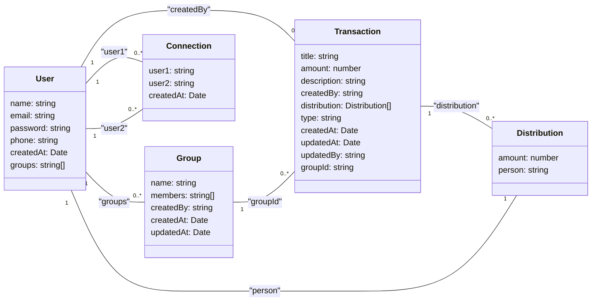

# Expense Manager

To run this project:

1. Install all the node modules using
   ```
   npm install
   ```
2. Get a latest copy of `.env` or create your own from `.env.example`
3. Start the project:
   - in dev server using
     ```
     npm start
     ```
   - using a debugger
     - Simply go to vs code run and debug panel and run as `Node: Nodemon`, this will run the project with a attached debugger.
     - Click before line no to add a red dot, this will be a breakpoint.
     - Nodemon will automatically refresh on new changes.
       > however this will be slower as compared to running project using `npm start`, but useful information is available if breakpoints are placed nicely.

# Entities and relations


